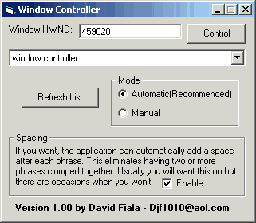



## Window Controller \- Control \*ANY\* Windows Via Speech Recognition And Dictation

### Description

Window controller allows you to control windows and dictate your speech. That means you can talk into your microphone, and it types for you. You can also say the names of command buttons, option buttons, check boxs, etc etc and they will be clicked/selected for you.

If you like it please leave comments and a vote. (Votes encourage more updates :p )
 
### More Info
 
You need:

- Microphone

- Microsoft Speech Object Library

- And you should probally do a training session or two so recognization is better. To do that: Control Panel -> Speech -> Click 'Train Profile' --- It may differ... your smart... figure it out

             |
---                |---
**Submitted On**   |2001-09-03 14:11:06
**By**             |[Close\_Account](https://github.com/Planet-Source-Code/PSCIndex/blob/master/ByAuthor/close-account.md)
**Level**          |Advanced
**User Rating**    |4.9 (39 globes from 8 users)
**Compatibility**  |VB 3\.0, VB 4\.0 \(16\-bit\), VB 4\.0 \(32\-bit\), VB 5\.0, VB 6\.0
**Category**       |[Complete Applications](https://github.com/Planet-Source-Code/PSCIndex/blob/master/ByCategory/complete-applications__1-27.md)
**World**          |[Visual Basic](https://github.com/Planet-Source-Code/PSCIndex/blob/master/ByWorld/visual-basic.md)
**Archive File**   |[Window Con25857932001\.zip](https://github.com/Planet-Source-Code/close-account-window-controller-control-any-windows-via-speech-recognition-and-dictation__1-26944/archive/master.zip)

### API Declarations

All In Code

